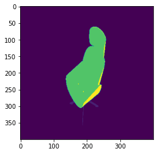
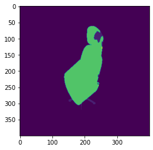
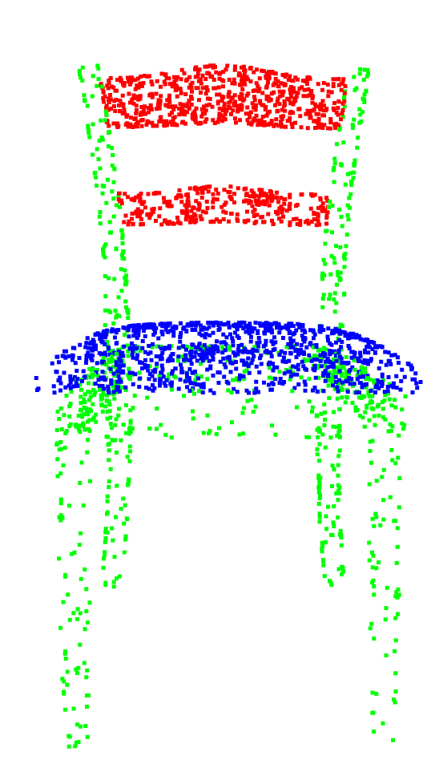
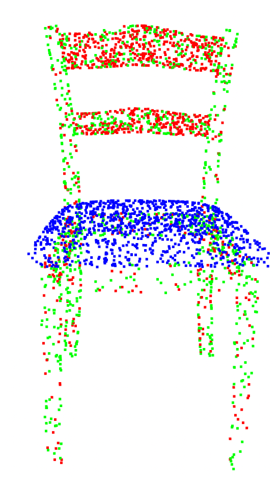
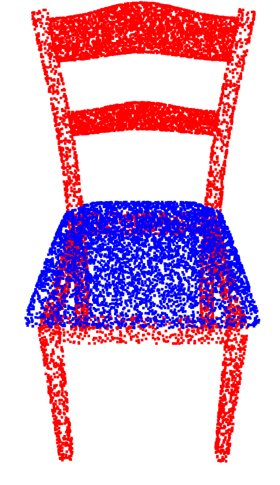
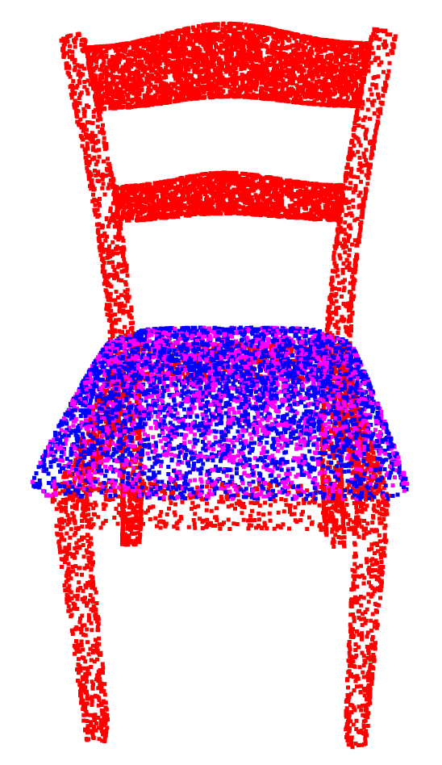

# qualitative

<table>
  <tr>
    <td>Task</td>
    <td>Ground Truth</td>
    <td>Prediction</td>
  </tr> 
  <tr>
    <td>BPNet 2D part segmentation</td>
    <td></td>
    <td></td>
   </tr> 
   <tr>
      <td>PointGroup 3D part segmentation</td>
      <td></td>
      <td></td>
  </tr>
  <tr>
      <td>PointGroup 3D material segmentation</td>
      <td></td>
      <td></td>
  </tr>
</table>
